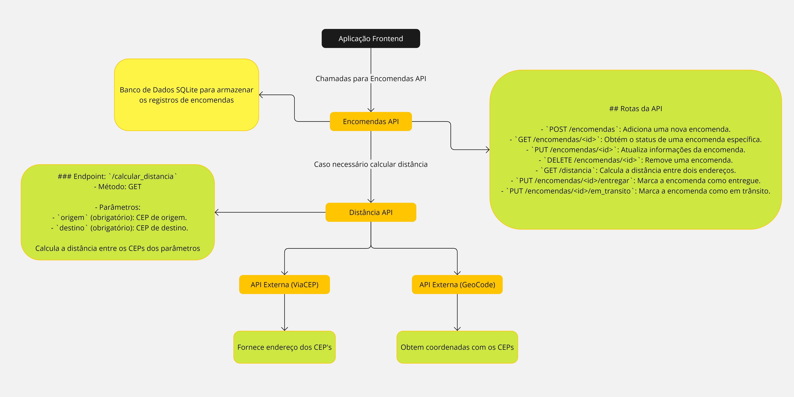

# Distância API

Este projeto é uma API para calcular a distância entre dois CEPs. Utiliza Flask, Flask-CORS e Flask-RESTX.

## Instalação

Para executar este projeto, siga os passos abaixo:

### Requisitos

- Docker instalado em sua máquina.

### Passos para execução

1. Clone este repositório:

   ```sh
   git clone https://github.com/vitaledu/MVP_API_CalcularDistanciaCEP
   cd MVP_API_CalcularDistanciaCEP
   ``` 

2.  Construa a imagem Docker:
    
    `docker build -t distancia-api .` 
    
3.  Crie uma rede Docker:
    
    `docker network create minha_rede` 
    
4.  Execute o container Docker:
    
    `docker run -d --name distancia_api --network minha_rede -p 5001:5001 distancia-api` 
    

A API estará disponível em `http://localhost:5001`.

## Uso da API

A API possui um endpoint principal para calcular a distância entre dois CEPs.

### Endpoint: `/calcular_distancia`

-   **Método:** GET
-   **Parâmetros:**

    -   `origem` (obrigatório): CEP de origem.
    -   `destino` (obrigatório): CEP de destino.

#### Exemplo de requisição

`curl -X GET "http://localhost:5001/calcular_distancia?origem=01001000&destino=20040030"` 

#### Exemplo de resposta

`{
  "origem": "01001000",
  "destino": "20040030",
  "distancia": 429.38
}` 

## Estrutura do Projeto

-   `app.py`: Arquivo principal da aplicação Flask.
-   `model/distancia_model.py`: Contém as funções para obter endereço via CEP, coordenadas e calcular distância.
-   `logger.py`: Configurações de log.

## Desenvolvimento

### Executando localmente

Se preferir executar a aplicação localmente sem Docker, siga os passos abaixo:

1.  Crie um ambiente virtual:
    
    `python -m venv venv` 
    
2.  Ative o ambiente virtual:
    
    No Windows:
    
    `venv\Scripts\activate` 
    
    No Unix ou MacOS:
    
    `source venv/bin/activate` 
    
3.  Instale as dependências:
    
    `pip install -r requirements.txt` 
    
4.  Execute a aplicação:
    
    `python app.py` 
    

A aplicação estará disponível em [http://localhost:5001](http://localhost:5001).

## Repositórios Relacionados

Este projeto faz parte de um conjunto de três repositórios que se complementam, mas cada um pode ser utilizado separadamente em outros projetos, caso necessário.

-   **API para Calcular Distância entre CEPs (este repositório)**
    -   GitHub: [MVP_API_CalcularDistanciaCEP](https://github.com/vitaledu/MVP_API_CalcularDistanciaCEP)
-   **API para Gestão de Encomendas**
    -   GitHub: [MVP_API_GestaoEncomendas](https://github.com/vitaledu/MVP_API_GestaoEncomendas)
-   **Frontend para Gestão de Encomendas**
    -   GitHub: [MVP_frontend_GestaoEncomendas](https://github.com/vitaledu/MVP_frontend_GestaoEncomendas)

-   **Miro com a Arquitetura da Aplicação** 
	- [**Link de Acesso**](https://miro.com/app/board/uXjVKzv-qXg=/)

## Diagrama da Aplicação


## Contato

Para mais informações, entre em contato com [eduardolimavital@gmail.com].